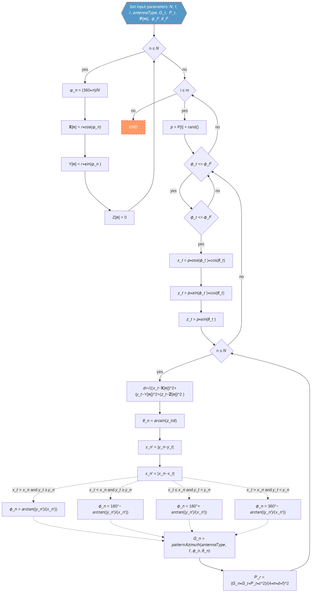

# Flowchart without considering noise

```mermaid
graph
    A{{"Set input parameters: 𝑁, 𝑓, 𝑟, 𝑎𝑛𝑡𝑒𝑛𝑛𝑎𝑇𝑦𝑝𝑒, 𝐺_𝑡,  𝑃_𝑡,  𝐏[𝐦],  𝜙_𝐹, 𝜃_𝐹"}} -->B{"n ≤ 𝑁"}
    style A fill:#5499C7,stroke:#f66,stroke-width:2px,color:#fff,stroke-dasharray: 5 5
    B -->|yes| B1["𝜑_𝑛 = (360∗𝑛)/𝑁"]
    B1 --> C1["𝐗[𝐧] = 𝑟∗𝑐𝑜𝑠(𝜑_𝑛)"]
    C1 --> D1["Y[𝐧] = 𝑟∗𝑠𝑖𝑛(𝜑_𝑛 )"]
    D1 --> E1["Z[𝐧] = 0"]
    E1 --> B
    

    B -->|no| C{"i ≤ m"}
    C -->|no| D[END]
    style D fill:#f96,stroke:#f66,stroke-width:2px,color:#fff,stroke-dasharray: 5 5
    C -->|yes| E["𝑝 = P[i] + rand()"]
    E --> F{"𝜙_𝑡 <= 𝜙_𝐹"}
    F --> |no| C
    F --> |yes| G{"𝜙_𝑡 <= 𝜙_𝐹"}
    G --> |no| F
    G --> |yes| H["𝑥_𝑡 = 𝑝∗𝑐𝑜𝑠(𝜙_𝑡 )∗cos(𝜃_𝑡)"]
    H --> I["𝑦_𝑡 = 𝑝∗𝑠𝑖𝑛(𝜙_𝑡 )∗cos(𝜃_𝑡)"] 
    I --> J["𝑧_𝑡 = 𝑝∗𝑠𝑖𝑛(𝜃_𝑡 )"]
    J --> K{"n ≤ 𝑁"} 
    K --> |no| F
    K --> |yes| L["𝑑=√((𝑥_𝑡−𝐗[𝐧])^2+(𝑦_𝑡−Y[𝐧])^2+(𝑧_𝑡−𝐙[𝐧])^2 )"]
    L --> M1["𝜃_𝑛 = 𝑎𝑟𝑐𝑠𝑖𝑛(𝑧_𝑡/𝑑)"]
    M1 --> M2["𝑦_𝑛′ = |𝑦_𝑛−𝑦_𝑡|"]
    M2 --> M["𝑥_𝑛′ = |𝑥_𝑛−𝑥_𝑡|"]
    
    
    M -.-> |"𝑥_𝑡 > 𝑥_𝑛 and 𝑦_𝑡 ≥ 𝑦_𝑛"| N["𝜙_𝑛 = 𝑎𝑟𝑐𝑡𝑎𝑛((𝑦_𝑛′)/(𝑥_𝑛′))"]
    M -.-> |"𝑥_𝑡 < 𝑥_𝑛 and 𝑦_𝑡 ≥ 𝑦_𝑛"| O["𝜙_𝑛 = 180°− 𝑎𝑟𝑐𝑡𝑎𝑛((𝑦_𝑛′)/(𝑥_𝑛′))"]
    M -.-> |"𝑥_𝑡 ≤ 𝑥_𝑛 and 𝑦_𝑡 < 𝑦_𝑛"| P["𝜙_𝑛 = 180°+ 𝑎𝑟𝑐𝑡𝑎𝑛((𝑦_𝑛′)/(𝑥_𝑛′))"]
    M -.-> |"𝑥_𝑡 > 𝑥_𝑛 and 𝑦_𝑡 < 𝑦_𝑛"| Q["𝜙_𝑛 = 360°− 𝑎𝑟𝑐𝑡𝑎𝑛((𝑦_𝑛′)/(𝑥_𝑛′))"]
    N & O & P & Q -.-> R["𝐺_𝑛 = 𝑝𝑎𝑡𝑡𝑒𝑟𝑛𝐴𝑧𝑖𝑚𝑢𝑡ℎ(𝑎𝑛𝑡𝑒𝑛𝑛𝑎𝑇𝑦𝑝𝑒, 𝑓, 𝜙_𝑛, 𝜃_𝑛)"]
    
    
    R --> S["𝑃_𝑟 = (𝐺_𝑛∗𝐺_𝑡∗𝑃_𝑡∗𝑐^2)/(4∗𝜋∗𝑑∗𝑓)^2 "]
    S --> K
```
