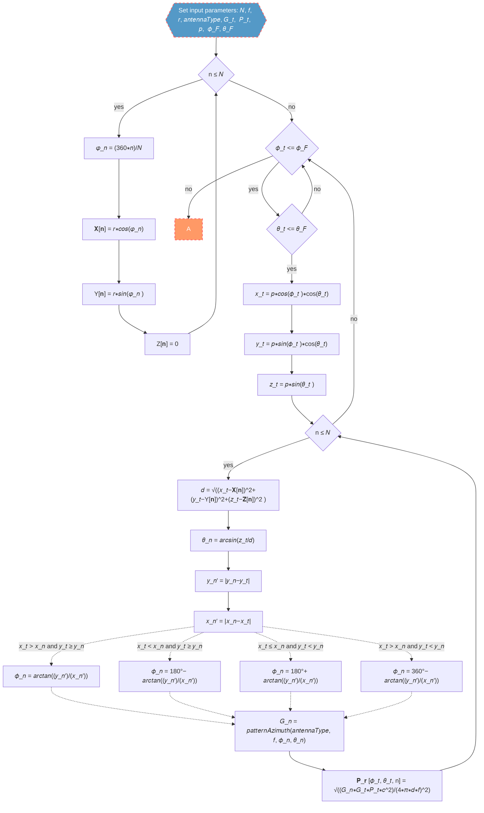
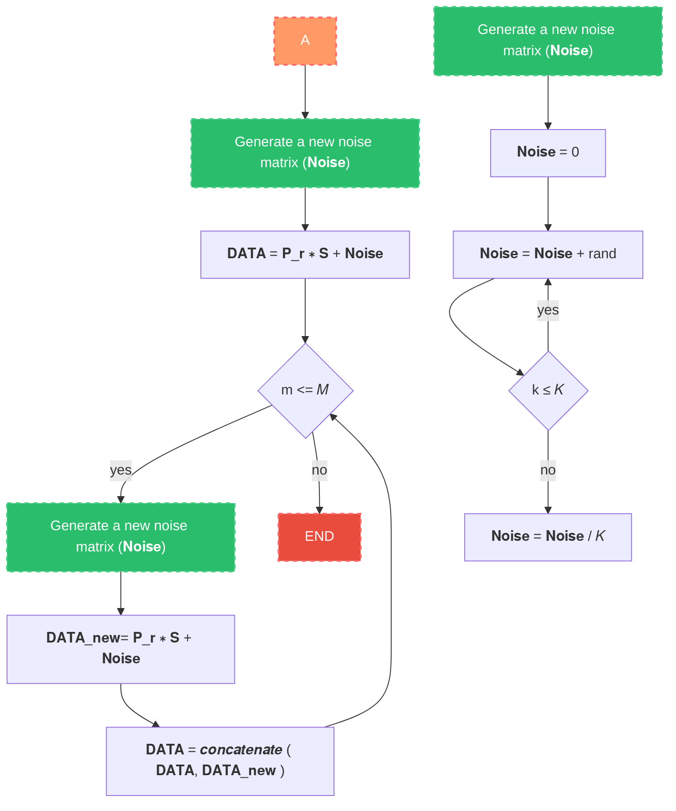
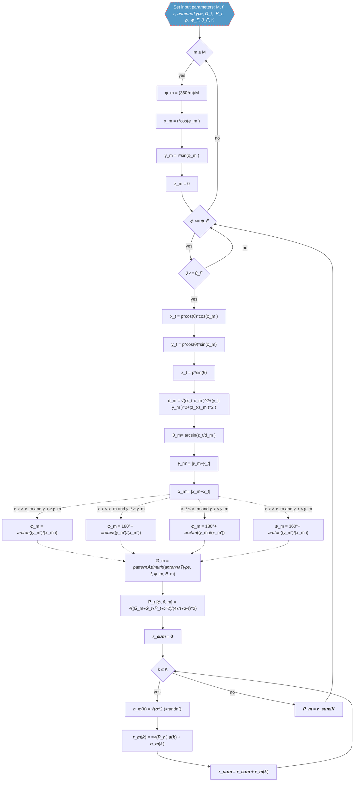

# Flowchart with noise

```mermaid
    graph
    A{{"Set input parameters: 𝑁, 𝑓, 𝑟, 𝑎𝑛𝑡𝑒𝑛𝑛𝑎𝑇𝑦𝑝𝑒, 𝐺_𝑡,  𝑃_𝑡,  𝑝,  𝜙_𝐹, 𝜃_𝐹"}} -->B{"n ≤ 𝑁"}
    style A fill:#5499C7,stroke:#f66,stroke-width:2px,color:#fff,stroke-dasharray: 5 5
    B -->|yes| B1["𝜑_𝑛 = (360∗𝑛)/𝑁"]
    B1 --> C1["𝐗[𝐧] = 𝑟∗𝑐𝑜𝑠(𝜑_𝑛)"]
    C1 --> D1["Y[𝐧] = 𝑟∗𝑠𝑖𝑛(𝜑_𝑛 )"]
    D1 --> E1["Z[𝐧] = 0"]
    E1 --> B
    

    B -->|no| F{"𝜙_𝑡 <= 𝜙_𝐹"}
    F -->|no| D[A]
    style D fill:#f96,stroke:#f66,stroke-width:2px,color:#fff,stroke-dasharray: 5 5
    
    F --> |yes| G{"𝜃_𝑡 <= 𝜃_𝐹"}
    G --> |no| F
    G --> |yes| H["𝑥_𝑡 = 𝑝∗𝑐𝑜𝑠(𝜙_𝑡 )∗cos(𝜃_𝑡)"]
    H --> I["𝑦_𝑡 = 𝑝∗𝑠𝑖𝑛(𝜙_𝑡 )∗cos(𝜃_𝑡)"] 
    I --> J["𝑧_𝑡 = 𝑝∗𝑠𝑖𝑛(𝜃_𝑡 )"]
    J --> K{"n ≤ 𝑁"} 
    K --> |no| F
    K --> |yes| L["𝑑 = √((𝑥_𝑡−𝐗[𝐧])^2+(𝑦_𝑡−Y[𝐧])^2+(𝑧_𝑡−𝐙[𝐧])^2 )"]
    L --> M1["𝜃_𝑛 = 𝑎𝑟𝑐𝑠𝑖𝑛(𝑧_𝑡/𝑑)"]
    M1 --> M2["𝑦_𝑛′ = |𝑦_𝑛−𝑦_𝑡|"]
    M2 --> M["𝑥_𝑛′ = |𝑥_𝑛−𝑥_𝑡|"]
    
    
    M -.-> |"𝑥_𝑡 > 𝑥_𝑛 and 𝑦_𝑡 ≥ 𝑦_𝑛"| N["𝜙_𝑛 = 𝑎𝑟𝑐𝑡𝑎𝑛((𝑦_𝑛′)/(𝑥_𝑛′))"]
    M -.-> |"𝑥_𝑡 < 𝑥_𝑛 and 𝑦_𝑡 ≥ 𝑦_𝑛"| O["𝜙_𝑛 = 180°− 𝑎𝑟𝑐𝑡𝑎𝑛((𝑦_𝑛′)/(𝑥_𝑛′))"]
    M -.-> |"𝑥_𝑡 ≤ 𝑥_𝑛 and 𝑦_𝑡 < 𝑦_𝑛"| P["𝜙_𝑛 = 180°+ 𝑎𝑟𝑐𝑡𝑎𝑛((𝑦_𝑛′)/(𝑥_𝑛′))"]
    M -.-> |"𝑥_𝑡 > 𝑥_𝑛 and 𝑦_𝑡 < 𝑦_𝑛"| Q["𝜙_𝑛 = 360°− 𝑎𝑟𝑐𝑡𝑎𝑛((𝑦_𝑛′)/(𝑥_𝑛′))"]
    N & O & P & Q -.-> R["𝐺_𝑛 = 𝑝𝑎𝑡𝑡𝑒𝑟𝑛𝐴𝑧𝑖𝑚𝑢𝑡ℎ(𝑎𝑛𝑡𝑒𝑛𝑛𝑎𝑇𝑦𝑝𝑒, 𝑓, 𝜙_𝑛, 𝜃_𝑛)"]
    
    
    R --> S["𝐏_𝐫 [𝜙_𝑡, 𝜃_𝑡, n] = √((𝐺_𝑛∗𝐺_𝑡∗𝑃_𝑡∗𝑐^2)/(4∗𝜋∗𝑑∗𝑓)^2)"]
    S --> K
```

```mermaid
    graph
    noise_1[A] --> ADD1["Generate a new noise matrix (𝐍𝐨𝐢𝐬𝐞)"]
    style ADD1 fill:#2ABD6C,stroke:#40CB7F,stroke-width:2px,color:#fff,stroke-dasharray: 5 5
    ADD1 --> noise_2["𝐃𝐀𝐓𝐀 = 𝐏_𝐫 ∗ 𝐒 + 𝐍𝐨𝐢𝐬𝐞"]
    style noise_1 fill:#f96,stroke:#f66,stroke-width:2px,color:#fff,stroke-dasharray: 5 5
    noise_2 --> noise_3{"m <= 𝑀"}
    noise_3 --> |yes|noise_5["Generate a new noise matrix (𝐍𝐨𝐢𝐬𝐞)"]
    style noise_5 fill:#2ABD6C,stroke:#40CB7F,stroke-width:2px,color:#fff,stroke-dasharray: 5 5
    noise_5 --> noise_6["𝐃𝐀𝐓𝐀_𝐧𝐞𝐰= 𝐏_𝐫 ∗ 𝐒 + 𝐍𝐨𝐢𝐬𝐞"]
    noise_6 --> noise_7["𝐃𝐀𝐓𝐀 = 𝒄𝒐𝒏𝒄𝒂𝒕𝒆𝒏𝒂𝒕𝒆 ( 𝐃𝐀𝐓𝐀, 𝐃𝐀𝐓𝐀_𝐧𝐞𝐰 )"]
    noise_7 --> noise_3
    
    noise_3 --> |no|noise_4[END]
    style noise_4 fill:#E74C3C,stroke:#f66,stroke-width:2px,color:#fff,stroke-dasharray: 5 5

    id_1["Generate a new noise matrix (𝐍𝐨𝐢𝐬𝐞)"] --> id_2["𝐍𝐨𝐢𝐬𝐞 = 0"]
    style id_1 fill:#2ABD6C,stroke:#40CB7F,stroke-width:2px,color:#fff,stroke-dasharray: 5 5
    id_2 --> id_3["𝐍𝐨𝐢𝐬𝐞 = 𝐍𝐨𝐢𝐬𝐞 + rand"]
    id_3 --> id_4{"k ≤ 𝐾"}
    id_4 --> |yes|id_3
    id_4 --> |no|id_5["𝐍𝐨𝐢𝐬𝐞 = 𝐍𝐨𝐢𝐬𝐞 / 𝐾"]
```

```mermaid
    graph
    A{{"Set input parameters: M, 𝑓, 𝑟, 𝑎𝑛𝑡𝑒𝑛𝑛𝑎𝑇𝑦𝑝𝑒, 𝐺_𝑡,  𝑃_𝑡,  𝑝,  𝜙_𝐹, 𝜃_𝐹, K"}} -->B{"m ≤ M"}
    style A fill:#5499C7,stroke:#f66,stroke-width:2px,color:#fff,stroke-dasharray: 5 5
    B -->|yes| B1["φ_m = (360*m)/M"]
    B1 --> C1["x_m = r*cos(φ_m )"]
    C1 --> D1["y_m = r*sin(φ_m )"]
    D1 --> E1["z_m = 0"]
    E1 --> F{"𝜙 <= 𝜙_𝐹"}
    %% F -->|no| D[A]
    
    F --> |no|B
    F --> |yes| G{"𝜃 <= 𝜃_𝐹"}
    G --> |no| F
    G --> |yes| H["x_t = p*cos(θ)*cos(ϕ_m )"]
    H --> I["y_t = p*cos(θ)*sin(ϕ_m)"] 
    I --> J["z_t = p*sin(θ)"]
    J --> L["d_m = √((x_t-x_m )^2+(y_t-y_m )^2+(z_t-z_m )^2 )"]
    L --> M1["θ_m= arcsin(z_t/d_m )"]
    M1 --> M2["𝑦_m′ = |𝑦_m−𝑦_𝑡|"]
    M2 --> M["𝑥_m′= |𝑥_m−𝑥_𝑡|"]
    
    
    M -.-> |"𝑥_𝑡 > 𝑥_m and 𝑦_𝑡 ≥ 𝑦_m"| N["𝜙_m = 𝑎𝑟𝑐𝑡𝑎𝑛((𝑦_m′)/(𝑥_m′))"]
    M -.-> |"𝑥_𝑡 < 𝑥_m and 𝑦_𝑡 ≥ 𝑦_m"| O["𝜙_m = 180°− 𝑎𝑟𝑐𝑡𝑎𝑛((𝑦_m′)/(𝑥_m′))"]
    M -.-> |"𝑥_𝑡 ≤ 𝑥_m and 𝑦_𝑡 < 𝑦_m"| P["𝜙_m = 180°+ 𝑎𝑟𝑐𝑡𝑎𝑛((𝑦_m′)/(𝑥_m′))"]
    M -.-> |"𝑥_𝑡 > 𝑥_m and 𝑦_𝑡 < 𝑦_m"| Q["𝜙_m = 360°− 𝑎𝑟𝑐𝑡𝑎𝑛((𝑦_m′)/(𝑥_m′))"]
    N & O & P & Q -.-> R["𝐺_m = 𝑝𝑎𝑡𝑡𝑒𝑟𝑛𝐴𝑧𝑖𝑚𝑢𝑡ℎ(𝑎𝑛𝑡𝑒𝑛𝑛𝑎𝑇𝑦𝑝𝑒, 𝑓, 𝜙_m, 𝜃_m)"]
    
    
    R --> S["𝐏_𝐫 [𝜙, 𝜃, m] = √((𝐺_m∗𝐺_𝑡∗𝑃_𝑡∗𝑐^2)/(4∗𝜋∗𝑑∗𝑓)^2)"]
    S --> T["𝒓_𝒔𝒖𝒎 = 𝟎"]
    T --> U{"k ≤ K"}
    U --> |yes|X["𝑛_𝑚(𝑘) = √(𝜎^2 )∗randn()"]
    X --> Y["𝒓_𝒎(𝒌) = =√(𝑷_𝒓 ) 𝒔(𝒌) + 𝒏_𝒎(𝒌)"]
    Y --> Z["𝒓_𝒔𝒖𝒎 = 𝒓_𝒔𝒖𝒎 + 𝒓_𝒎(𝒌)"]
    Z --> U
    U --> |no|Z1["𝑷_𝒎 = 𝒓_𝒔𝒖𝒎/𝑲"]
    Z1 --> F
```
