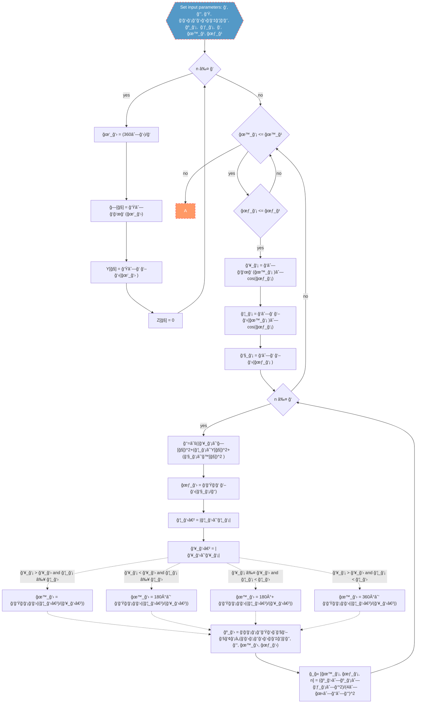
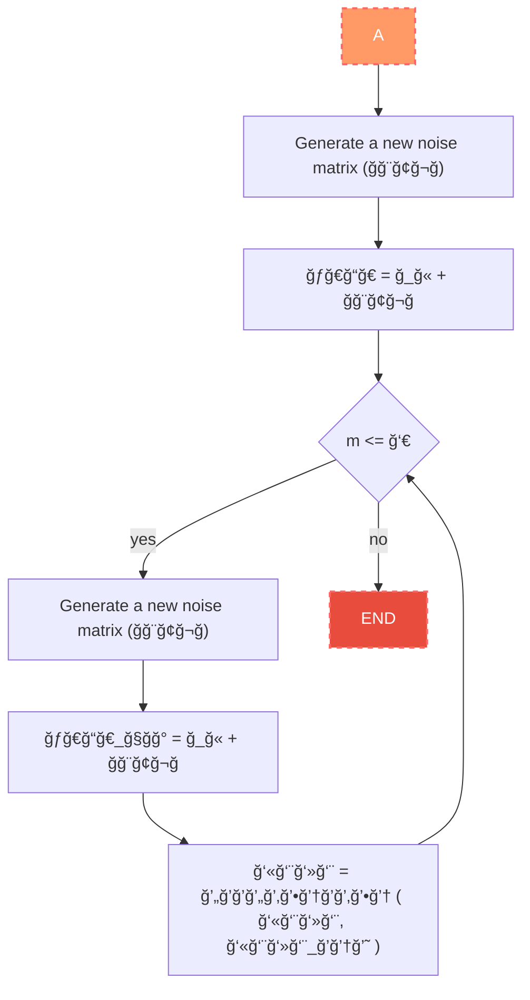

# Flowchart without considering noise

```mermaid
    graph
    A{{"Set input parameters: ğ‘, ğ‘“, ğ‘Ÿ, ğ‘ğ‘›ğ‘¡ğ‘’ğ‘›ğ‘›ğ‘ğ‘‡ğ‘¦ğ‘ğ‘’, ğº_ğ‘¡,  ğ‘ƒ_ğ‘¡,  ğ‘,  ğœ™_ğ¹, ğœƒ_ğ¹"}} -->B{"n ≤ ğ‘"}
    style A fill:#5499C7,stroke:#f66,stroke-width:2px,color:#fff,stroke-dasharray: 5 5
    B -->|yes| B1["ğœ‘_ğ‘› = (360∗ğ‘›)/ğ‘"]
    B1 --> C1["ğ—[ğ§] = ğ‘Ÿâˆ—ğ‘ğ‘œğ‘ (ğœ‘_ğ‘›)"]
    C1 --> D1["Y[ğ§] = ğ‘Ÿâˆ—ğ‘ ğ‘–ğ‘›(ğœ‘_ğ‘› )"]
    D1 --> E1["Z[ğ§] = 0"]
    E1 --> B
    

    B -->|no| F{"ğœ™_ğ‘¡ <= ğœ™_ğ¹"}
    F -->|no| D[A]
    style D fill:#f96,stroke:#f66,stroke-width:2px,color:#fff,stroke-dasharray: 5 5
    
    F --> |yes| G{"ğœƒ_ğ‘¡ <= ğœƒ_ğ¹"}
    G --> |no| F
    G --> |yes| H["ğ‘¥_ğ‘¡ = ğ‘∗ğ‘ğ‘œğ‘ (ğœ™_ğ‘¡ )∗cos(ğœƒ_ğ‘¡)"]
    H --> I["ğ‘¦_ğ‘¡ = ğ‘∗ğ‘ ğ‘–ğ‘›(ğœ™_ğ‘¡ )∗cos(ğœƒ_ğ‘¡)"] 
    I --> J["ğ‘§_ğ‘¡ = ğ‘∗ğ‘ ğ‘–ğ‘›(ğœƒ_ğ‘¡ )"]
    J --> K{"n ≤ ğ‘"} 
    K --> |no| F
    K --> |yes| L["ğ‘‘=√((ğ‘¥_ğ‘¡âˆ’ğ—[ğ§])^2+(ğ‘¦_ğ‘¡âˆ’Y[ğ§])^2+(ğ‘§_ğ‘¡âˆ’ğ™[ğ§])^2 )"]
    L --> M1["ğœƒ_ğ‘› = ğ‘ğ‘Ÿğ‘ğ‘ ğ‘–ğ‘›(ğ‘§_ğ‘¡/ğ‘‘)"]
    M1 --> M2["ğ‘¦_ğ‘›â€² = |ğ‘¦_ğ‘›âˆ’ğ‘¦_ğ‘¡|"]
    M2 --> M["ğ‘¥_ğ‘›â€² = |ğ‘¥_ğ‘›âˆ’ğ‘¥_ğ‘¡|"]
    
    
    M -.-> |"ğ‘¥_ğ‘¡ > ğ‘¥_ğ‘› and ğ‘¦_𑡠≥ ğ‘¦_ğ‘›"| N["ğœ™_ğ‘› = ğ‘ğ‘Ÿğ‘ğ‘¡ğ‘ğ‘›((ğ‘¦_ğ‘›â€²)/(ğ‘¥_ğ‘›â€²))"]
    M -.-> |"ğ‘¥_ğ‘¡ < ğ‘¥_ğ‘› and ğ‘¦_𑡠≥ ğ‘¦_ğ‘›"| O["ğœ™_ğ‘› = 180°− ğ‘ğ‘Ÿğ‘ğ‘¡ğ‘ğ‘›((ğ‘¦_ğ‘›â€²)/(ğ‘¥_ğ‘›â€²))"]
    M -.-> |"ğ‘¥_𑡠≤ ğ‘¥_ğ‘› and ğ‘¦_ğ‘¡ < ğ‘¦_ğ‘›"| P["ğœ™_ğ‘› = 180°+ ğ‘ğ‘Ÿğ‘ğ‘¡ğ‘ğ‘›((ğ‘¦_ğ‘›â€²)/(ğ‘¥_ğ‘›â€²))"]
    M -.-> |"ğ‘¥_ğ‘¡ > ğ‘¥_ğ‘› and ğ‘¦_ğ‘¡ < ğ‘¦_ğ‘›"| Q["ğœ™_ğ‘› = 360°− ğ‘ğ‘Ÿğ‘ğ‘¡ğ‘ğ‘›((ğ‘¦_ğ‘›â€²)/(ğ‘¥_ğ‘›â€²))"]
    N & O & P & Q -.-> R["ğº_ğ‘› = ğ‘ğ‘ğ‘¡ğ‘¡ğ‘’ğ‘Ÿğ‘›ğ´ğ‘§ğ‘–ğ‘šğ‘¢ğ‘¡â„(ğ‘ğ‘›ğ‘¡ğ‘’ğ‘›ğ‘›ğ‘ğ‘‡ğ‘¦ğ‘ğ‘’, ğ‘“, ğœ™_ğ‘›, ğœƒ_ğ‘›)"]
    
    
    R --> S["ğ_ğ« [ğœ™_ğ‘¡, ğœƒ_ğ‘¡, n] = (ğº_ğ‘›âˆ—ğº_ğ‘¡âˆ—ğ‘ƒ_ğ‘¡âˆ—ğ‘^2)/(4∗ğœ‹âˆ—ğ‘‘∗ğ‘“)^2 "]
    S --> K
```

```mermaid
    graph 
    noise_1[A] --> ADD1["Generate a new noise matrix (ğğ¨ğ¢ğ¬ğ)"]
    ADD1 --> noise_2["ğƒğ€ğ“ğ€ = ğ_ğ« + ğğ¨ğ¢ğ¬ğ"]
    style noise_1 fill:#f96,stroke:#f66,stroke-width:2px,color:#fff,stroke-dasharray: 5 5
    noise_2 --> noise_3{"m <= ğ‘€"}
    noise_3 --> |yes|noise_5["Generate a new noise matrix (ğğ¨ğ¢ğ¬ğ)"]
    noise_5 --> noise_6["ğƒğ€ğ“ğ€_ğ§ğğ° = ğ_ğ« + ğğ¨ğ¢ğ¬ğ"]
    noise_6 --> noise_7["ğ‘«ğ‘¨ğ‘»ğ‘¨ = ğ’„ğ’ğ’ğ’„ğ’‚ğ’•ğ’†ğ’ğ’‚ğ’•ğ’† ( ğ‘«ğ‘¨ğ‘»ğ‘¨, ğ‘«ğ‘¨ğ‘»ğ‘¨_ğ’ğ’†ğ’˜ )"]
    noise_7 --> noise_3
    
    noise_3 --> |no|noise_4[END]
    style noise_4 fill:#E74C3C,stroke:#f66,stroke-width:2px,color:#fff,stroke-dasharray: 5 5
```
